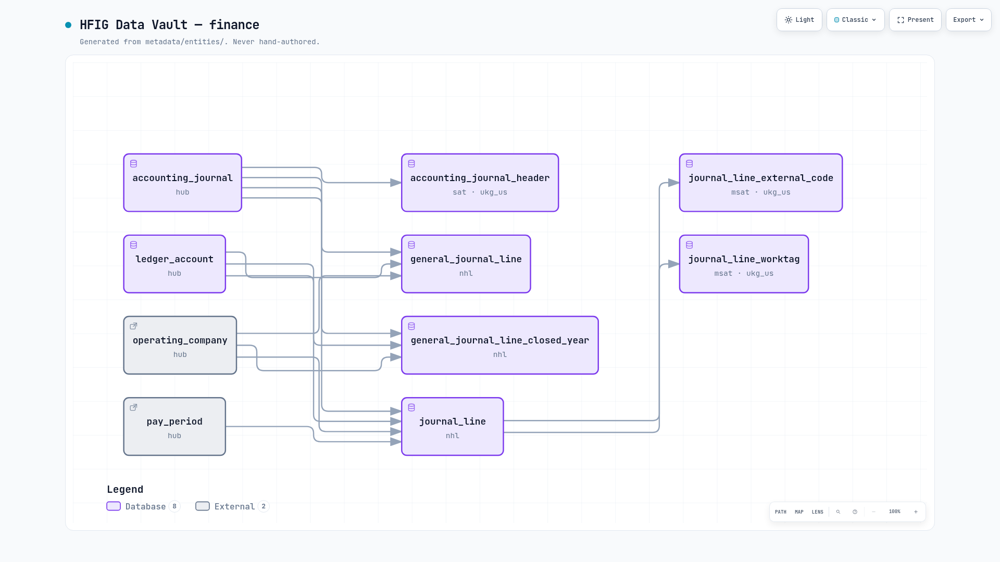
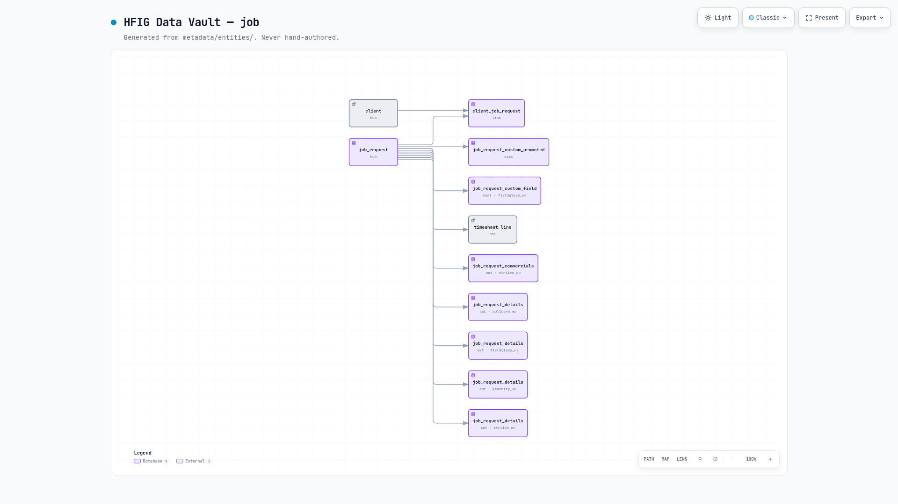
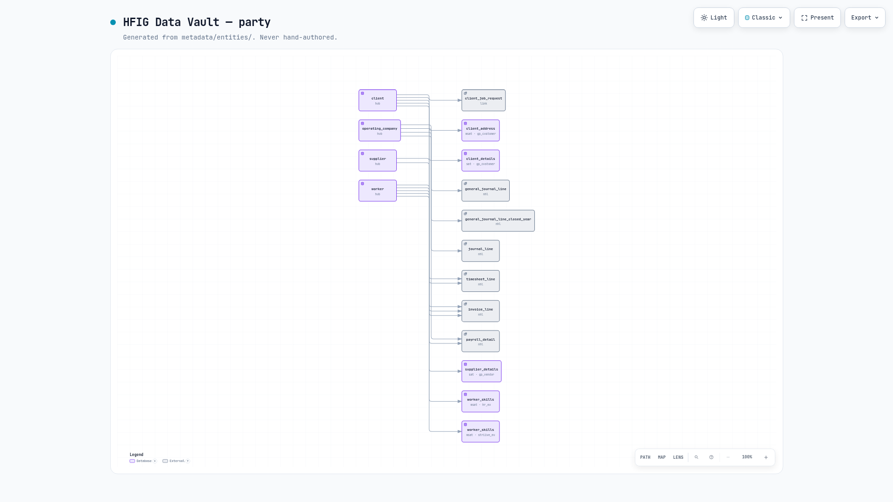
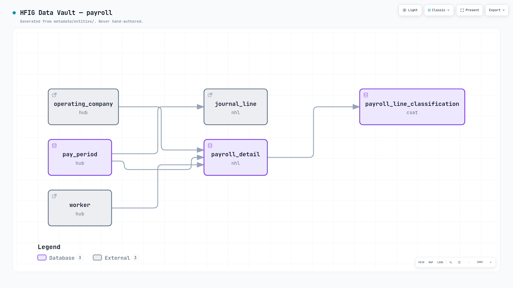
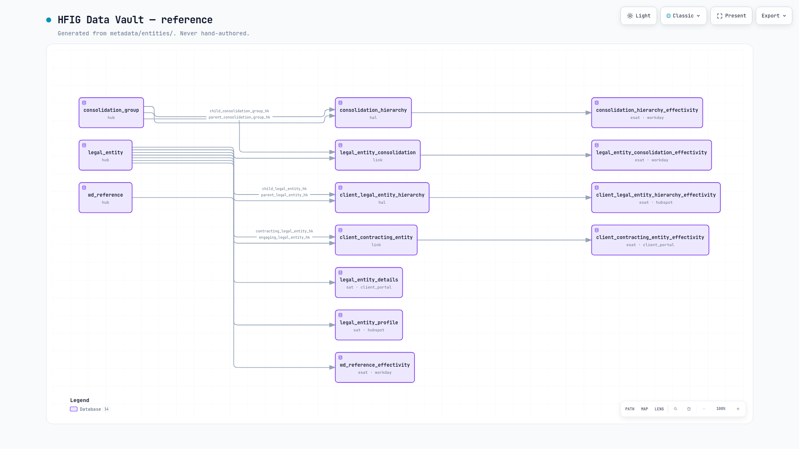
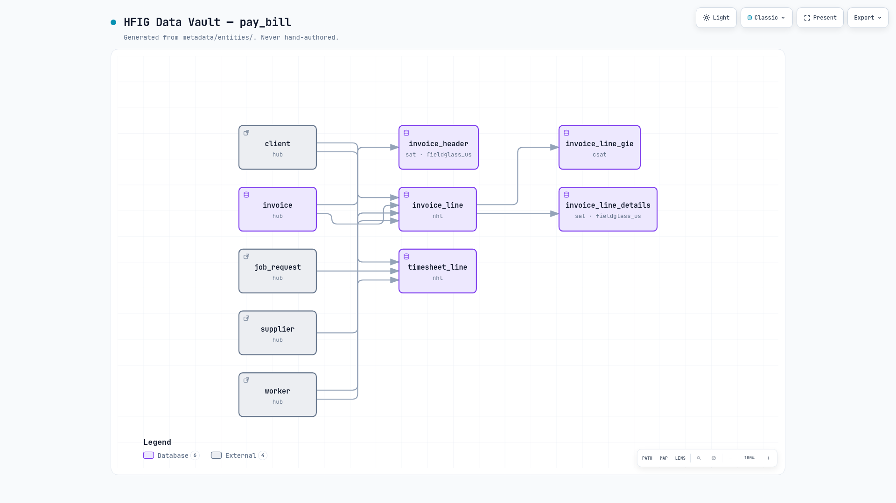
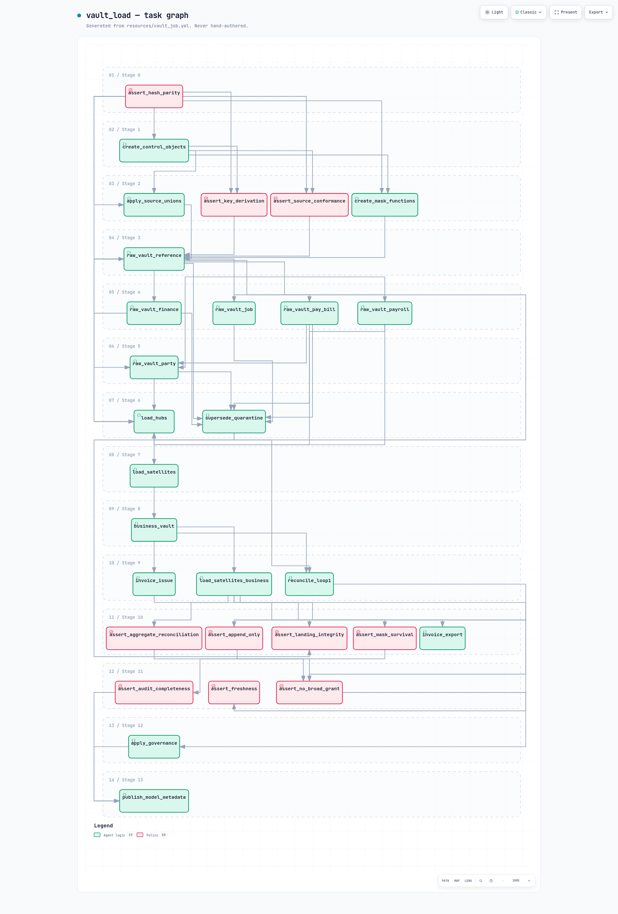

# diagram/

## `hfig_data_vault.dbml` — GENERATED, never hand-edited

Produced by `tools/emit_dbml_diagram.py` from `metadata/entities/`. `verify_repo.py` fails the
build if regenerating it produces a diff, so the diff is the review. Paste it into
[dbdiagram.io](https://dbdiagram.io) to explore.

Every arrow is a parent declared in the model, derived through `accelerator.contract` — the
same module the published data contracts are built from, so the diagram and the contracts
cannot disagree about what a table holds.

**No counts are written here.** This paragraph used to say "25 tables, 369 columns, 31
relationships"; by 6 September the model held 29 tables and 35 relationships and the sentence
had been wrong for days. A number in prose is a second authority that nothing regenerates —
the same drift the standing no-hardcoded-count rule exists for. Run `tools/emit_dbml_diagram.py`
or read the file.

## `hfig_data_vault.dbdiagram` — a VS Code extension's layout file

Written by a DBML extension in VS Code (not by anything in this repo, and not a dbdiagram.io
browser export — an earlier version of this file said browser, which was a guess). It holds
`tablePositions` for 25 tables — **fewer than the model now holds**, which is exactly the
staleness the last paragraph describes — plus `tableGroupCollapseStates`, `stickyNoteLayouts`,
`referencePaths`, `detailLevel` and `relationshipMode`.

**Its content is a human judgement, even though a tool writes the file.** Table positions are
somebody deciding what makes the picture legible — which concepts sit near each other, where
the finance cluster goes. No emitter here can produce that, so nothing in this repo generates
or gates it, and regenerating the `.dbml` does not touch it.

**Safe to commit, and diffs will mean something.** Inspected 3 September: the file carries no
timestamps, no `created`/`updated` fields and no random identifiers — only layout content. So
it does not churn on open or save, and a diff on it is a real layout change rather than noise.
That is why it is tracked rather than ignored.

**What can go stale.** The layout holds a position per table. Add or rename an entity and the
`.dbml` changes on the next regeneration while this file still describes the old set — the new
table simply arrives unpositioned. A nuisance rather than a defect; re-open, arrange, save.

Keep both: the `.dbml` is the truth about the model, the `.dbdiagram` is the truth about how we
like to look at it.

## `hfig_*.archify.json` — GENERATED, never hand-edited

Produced by `tools/emit_archify.py`. One `architecture` document per domain in
`metadata/entities/`, plus one `workflow` document for the load job in
`resources/vault_job.yml`. `verify_repo.py` fails the build if regenerating any of them
produces a diff, if a document is orphaned or missing, or if the union of their connections
stops matching the DBML's `Ref:` edges.

**A domain document draws other domains' tables for context**, typed `external` and never
counted as belonging to it. That is how the split keeps every edge: a foreign key crossing a
domain boundary appears in both documents rather than being dropped from one.

**Being well-formed is not the same as being drawable**, and this is the one thing worth
remembering here. The vendored JSON Schemas do not describe the renderer's geometry, so
`tools/archify_render_gate.py` asks Archify's own validator instead. It needs Node and the
installed skill; where those are absent it skips and says so — see `vendor/archify/README.md`
and the 6 Sep entry in `docs/superpowers/OPEN_ITEMS.md`.

**These are the intermediate representation, not the picture.** One command renders both
forms:

```bash
uv run --frozen python tools/render_archify.py
```

It writes a standalone HTML page per document into `diagram/html/` and a full-page PNG into
`diagram/img/`.

**`diagram/html/` is tracked**, and byte-gated like every other generated artefact here:
`verify_repo` re-renders each page and fails on a diff. It stands that gate down, with the
reason printed, when the renderer is absent or when the installed Archify differs from
`accelerator.archify.RENDERER_VERSION` — `deliver` output is byte-stable within one version
and says nothing about another. Change the renderer and you re-render and bump the constant
in the same commit.

**A page is ~700KB and GitHub will not render it.** Each one inlines the whole viewer
runtime, and GitHub serves a committed `.html` as a source blob, never as a page — clone or
download to open one. What you get locally is theme switching, pan/zoom, search,
relationship tracing and PNG/SVG export, all offline.

**`diagram/img/` is what you can actually see on GitHub**, at ~90KB apiece, embedded below.
GitHub Pages is not the alternative — this repository is private, and Pages on a private
repository publishes publicly unless the account is on Enterprise.

**The images are gated for existence, not for content.** `verify_repo` asserts there is
exactly one image per document, so a domain that appears or disappears is caught. It cannot
assert an image MATCHES its document, because regenerating one needs a browser. These are
therefore the one artefact here that can silently go stale — the same caveat
`hfig_data_vault.dbdiagram` carries. Re-run the command above whenever the model changes.

They are dark because the viewer resolves its own theme and defaults to dark;
`--force-prefers-color-scheme=light` does not override it. A dark card reads correctly on
either GitHub theme.

### The vault, by domain








### The load job



### Layout constants, measured against a browser

The canvas carries a minimum 1.6 landscape aspect and the row pitch is 68/28. Both exist
because the viewer scales the authored canvas up to the reading width: at the natural size
`hfig_job` (nine tables off one hub) magnified its first two boxes to 260×170px and needed
2771px of scroll on a 1440×900 desktop. The padding is added to the canvas and the grid
origin re-centred in it, so **no box moves relative to another** — the layout the render
gate approved is the one that ships. `hfig_workflow` still scrolls vertically, and
correctly: twelve dependency stages is a tall picture, and nothing can flatten it without
lying about the load.
